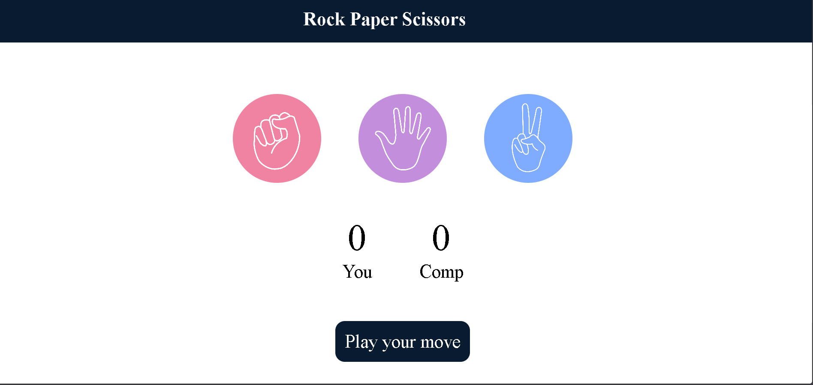

# Rock Paper Scissors Game 🎮

A simple and interactive **Rock Paper Scissors** game built using **HTML, CSS, and JavaScript**.  
This project demonstrates core frontend concepts such as DOM manipulation, event handling, and basic game logic.

---

## 📌 Features

- Classic Rock ✊, Paper ✋, Scissors ✌️ gameplay
- User vs Computer
- Random computer choice generation
- Real-time score tracking
- Clear win / lose / draw result display
- Clean and responsive UI
- Beginner-friendly project structure

---

## 🛠️ Technologies Used

- **HTML5** – Structure of the game
- **CSS3** – Styling and layout
- **JavaScript (Vanilla JS)** – Game logic and interactivity

---

## 📂 Project Structure

├── index.html # Main HTML file
├── style.css # Styling file
├── script.js # Game logic
└── README.md # Project documentation

---

## 🚀 How to Run the Project

1. Download or clone the repository
   ```bash
   git clone https://github.com/princekumar9234/rock-paper-scissors.git
   ```

---

If you want, I can also:

- Customize it for **GitHub upload**
- Add **badges**
- Make a **resume-ready README**
- Generate a **project report (PDF)**

Just tell me.

### Stone paper View


